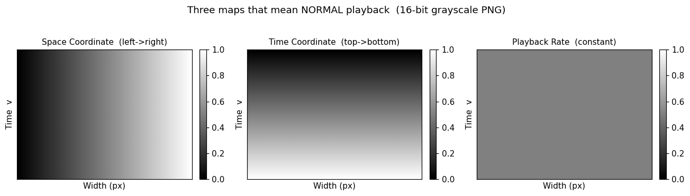
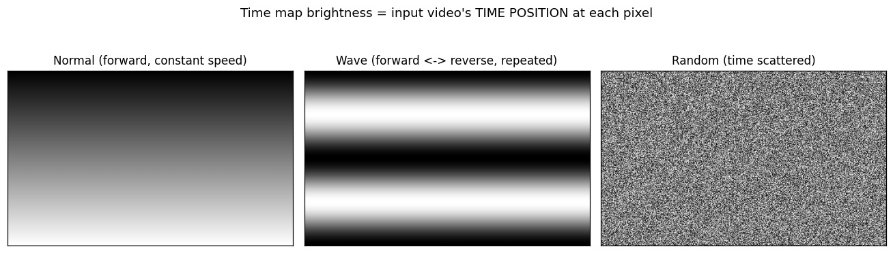
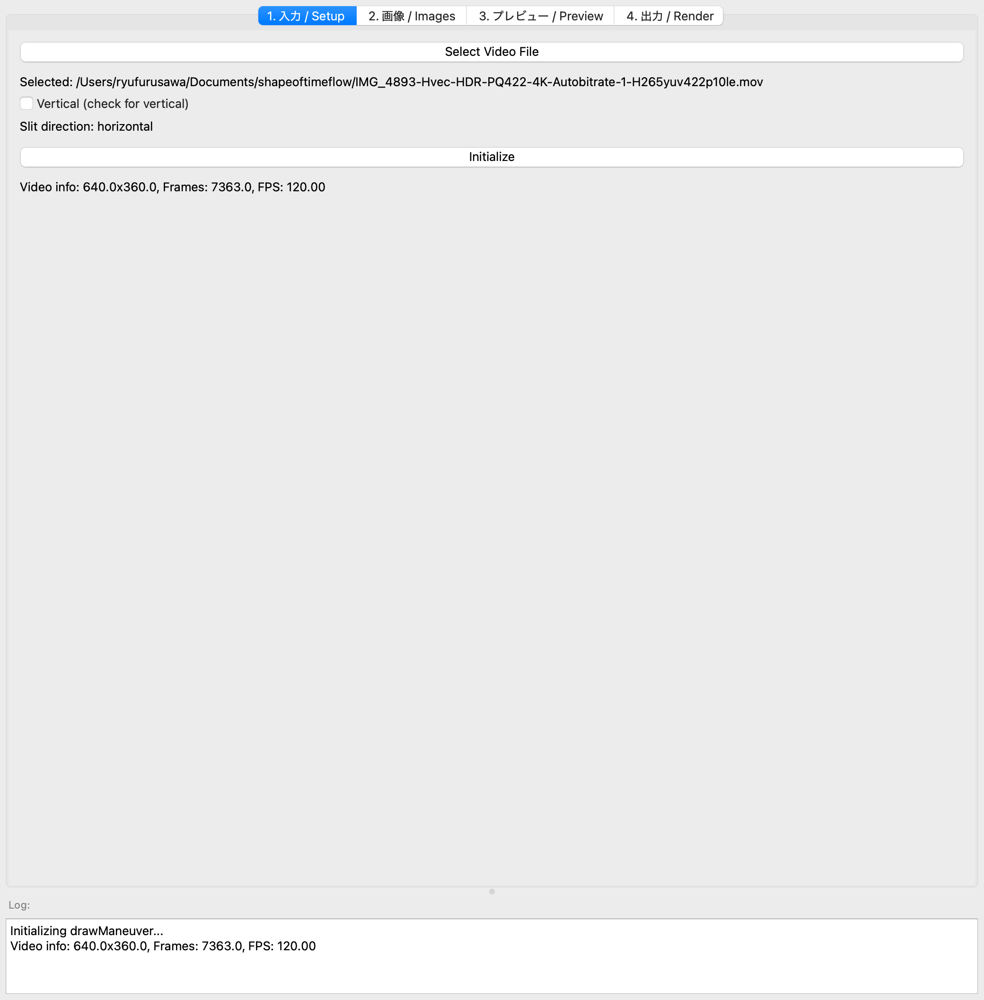
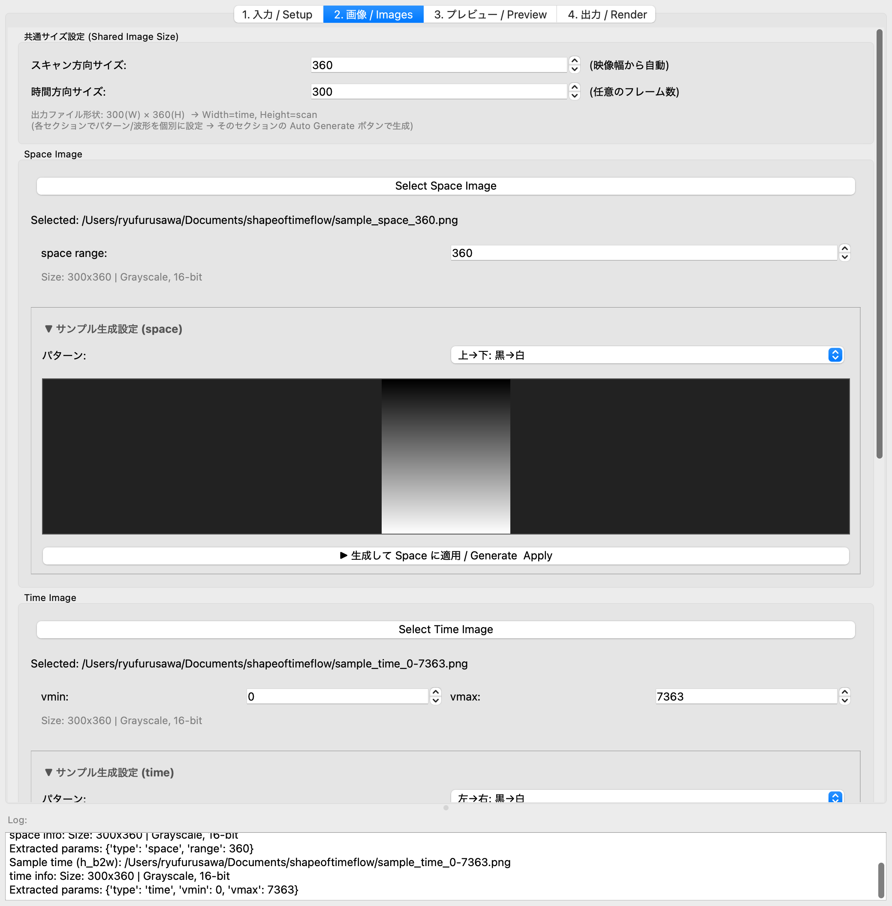
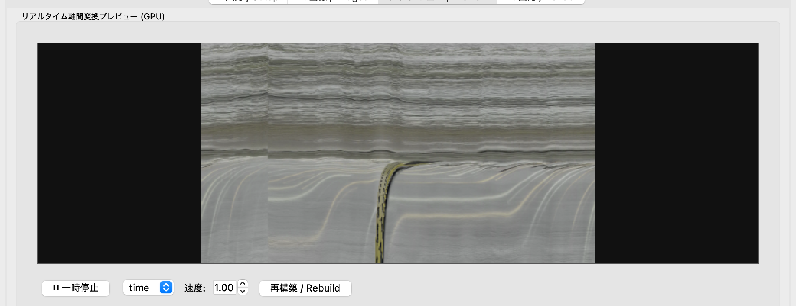
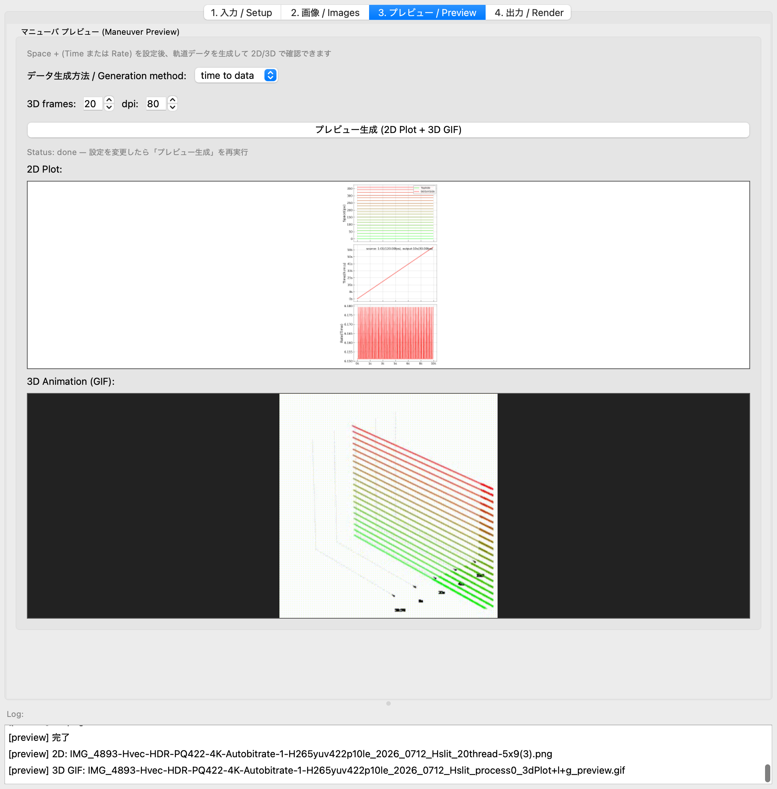
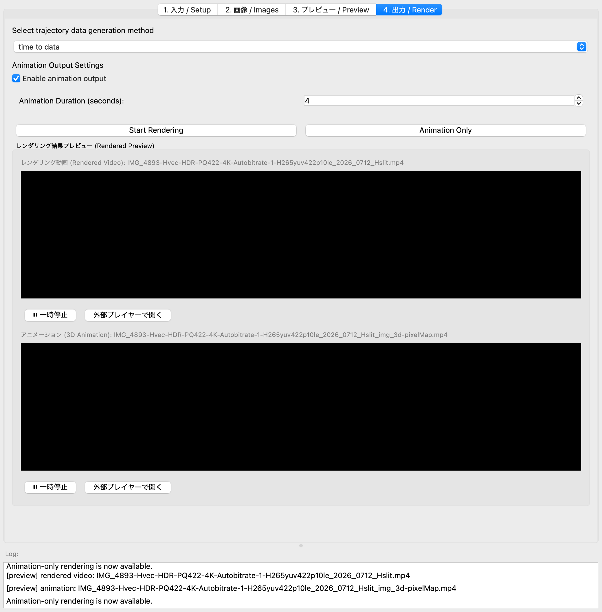
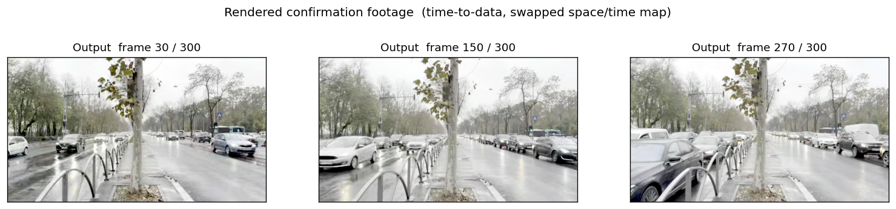
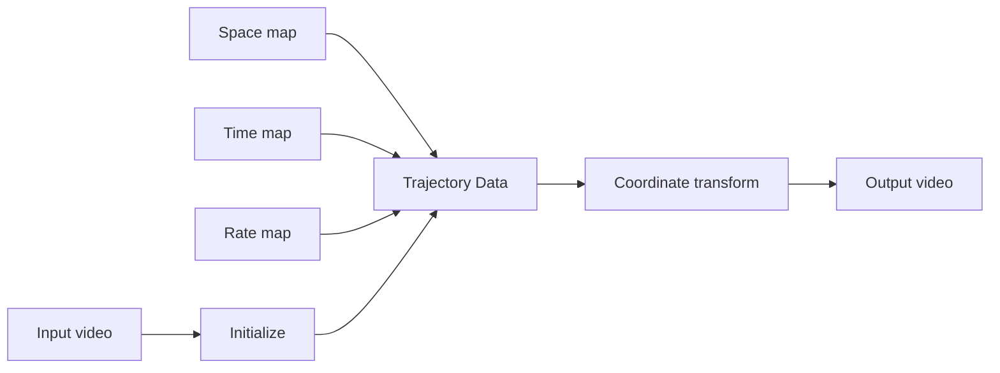

# Shape of Time Flow

[日本語](README.md) | **English**

`Shape_of_time_flow.py` is a PyQt5 GUI tool that lets you freely **draw** the
**time, space, and playback rate** of a video — one grayscale image (a "map")
for each — to create footage with a **new shape of time flow**, where reverse
and forward playback can happen at the same time.

A moving image is a sequence of still frames. This tool turns that structure
into a canvas: each pixel of the output is told *which time, which space, and
what speed* of the input video to sample. (A tool for media artist Ryu Furusawa's
workshop *Shape of Time Flow*.)

---

## Table of Contents

- [The idea: three maps](#the-idea-three-maps)
- [Vertical / Horizontal slit](#vertical--horizontal-slit)
- [Setup](#setup-venv-recommended)
- [Walkthrough (one full pass)](#walkthrough-one-full-pass)
- [Pipeline](#pipeline)
- [Output image format (drawing your own in Photoshop)](#output-image-format-drawing-your-own-in-photoshop)
- [Language switch (Japanese / English UI)](#language-switch-japanese--english-ui)
- [Credits / Reference works](#credits--reference-works)

---

## The idea: three maps

Instead of working frame by frame, the whole video is treated as a single image.
For the input video you prepare these **three 16-bit grayscale PNGs**:



| Map | What brightness means | "Normal playback" looks like |
|-----|-----------------------|------------------------------|
| **Space** | which position along the slit each pixel samples | left→right black→white gradient (pass-through, 1:1) |
| **Time** | which *moment* of the input video each pixel samples | top→bottom black→white gradient (start→end, constant speed) |
| **Rate** | playback speed / direction (fast / slow / reverse / stop) | flat 50% gray (constant, forward) |

**Redrawing** these "normal playback" maps changes the flow of time itself.
For example, drawing a wave into the Time map makes forward and reverse playback
alternate periodically.



> Time-map brightness = the input video's *time position* at each pixel.
> A smooth top→bottom brightening is constant forward playback; a reversal in
> the middle mixes in reverse playback.

---

## Vertical / Horizontal slit

Each output frame is built by taking a single line (a "slit") from the input
video and stacking it along the time axis. Toggle the slit direction with the
**Vertical** checkbox on the Setup tab.

- **Vertical (column)**: scans the frame with a vertical line.
- **Horizontal (row)**: scans the frame with a horizontal line.

Map orientation is generated to match this automatically.

---

## Setup (venv recommended)

Create a clean virtual environment, then install the dependencies.

```bash
# Create & activate a virtual environment
python -m venv .venv
source .venv/bin/activate        # Windows: .venv\Scripts\activate

# Third-party dependencies
pip install -r requirements.txt

# imgtrans (drawManeuver) — NOT the unrelated "imgtrans" on PyPI.
# Do not run `pip install imgtrans`; install from git instead:
pip install git+https://github.com/ryufurusawa/imgtrans.git
```

> **Note**: `imgtrans` pulls in heavy dependencies (numba / av (PyAV) / librosa),
> and **FFmpeg** (`ffmpeg` and `ffprobe`) must be on your system PATH.

### Run

```bash
python Shape_of_time_flow.py
```

---

## Walkthrough (one full pass)

The window has four tabs. Below is one full pass with a real video:
**initialize with a horizontal slit → generate the space & time maps swapped →
preview and render with "time to data" → view the confirmation footage.**

### 1. Setup



1. Click **Select Video File** and pick your source clip (2–3 min of interesting
   *motion* works well).
2. Choose the slit direction. Here we use a **horizontal slit**, so leave
   **Vertical** unchecked (`Slit direction: horizontal`).
3. Click **Initialize**. Video info (resolution, frame count, FPS) is loaded and
   a working folder is created next to the input video. The other tabs unlock.

### 2. Images (swap space and time)



1. **Shared Image Size**: scan-direction size is taken from the video
   automatically (360 here). Set the **time-direction size to 300**
   (= 300-frame output length).
2. **Swap the Space / Time maps** and generate them:
   - Set the **Space** pattern to **"top→bottom: black→white"** (normally Time's look).
   - Set the **Time** pattern to **"left→right: black→white"** (normally Space's look).
   - Press each section's **"▶ Generate & Apply"** to create and auto-assign the
     16-bit PNGs (`sample_space_360.png` / `sample_time_0-7363.png`).

   Now space references the time axis and time references the space axis — the
   default state with **time and space exchanged**.

> To use your own images, pick a
> [16-bit grayscale PNG](#output-image-format-drawing-your-own-in-photoshop)
> via **Select Space / Time / Rate Image**.

### 3. Preview (time to data)

#### Realtime axis-transform preview (GPU)



At the top of the Preview tab, **Realtime axis-transform preview (GPU)** lets you
see the transformed result **in real time, without waiting for a render** — for
fast iteration in workshops.

- Press **Rebuild** to downscale the input to SD/HD, keep a window of frames
  resident on the GPU, and display the per-pixel transform driven by the current
  space/time maps.
- **Play/Pause**, **time / rate** mode, and **speed** are adjustable; edit a map
  and Rebuild to see it immediately.
- Resolution follows the input (up to Full HD, never upscaled); preview
  resolution is auto-adjusted to fit device memory (the chosen S / F / memory is
  shown below).
- The GPU path uses **wgpu (Metal / D3D12 / Vulkan)**; it falls back to CPU
  automatically where no GPU is available.

> The transform itself is essentially free on the GPU; the only cost is the
> one-time decode and memory (frames × resolution).

#### Trajectory check (2D / 3D)



1. Set **Generation method** to **time to data**.
2. Press **Generate Preview (2D Plot + 3D GIF)** to build the trajectory data and
   show:
   - **2D Plot** (Space / Time / Rate trajectories)
   - **3D Animation (GIF)** (the trajectory in 3D)

   This lets you confirm *what the flow of time will be* before rendering.

### 4. Render (render + animation export)



1. Set **Select trajectory data generation method** to **time to data**.
2. Check **Enable animation output** (also exports the 3D trajectory animation)
   and set the Animation Duration (seconds).
3. Press **Start Rendering**; progress appears in the **Log** at the bottom.
4. When finished, the **Rendered Preview** loads the output video and the 3D
   animation into embedded players (there is also an **Open in external player**
   button).

Example frames of the exported confirmation footage:



The street scene of the input video is output with its time/space relationship
rebuilt according to the swapped maps.

---

## Pipeline



The three maps (Space / Time / Rate) are assembled into trajectory data (where
each pixel samples the input video), then a coordinate transform produces the
final footage.

---

## Output image format (drawing your own in Photoshop)

When drawing maps by hand, save them like this:

- Set the color mode to **16-bit grayscale** (Image / Mode → 16-bit grayscale).
- **Flatten all layers** (16-bit requires a single layer).
- Match the image resolution to the slit direction and output length
  (e.g. height 1800px for a vertical slit at 1 min / 30fps).
- Save as **PNG** (File / Save As).
- Embed the range in the filename (e.g. `time_0-1800.png`, `space_640.png`,
  `rate_1.00.png`).

In Photoshop, the gradient tool / smudge tool / adjustment brush / multiple
layers / transform (warp) let you draw smooth, organic "shapes of time".

---

## Language switch (Japanese / English UI)

Use **Language / 言語** at the top-right of the Setup tab to switch the UI between
**Japanese and English**. The default at startup is Japanese. To start in English
you can also set an environment variable:

```bash
STF_LANG=en python Shape_of_time_flow.py
```

---

## Credits / Reference works

**Instructor / Author:** Ryu Furusawa (media artist) — <https://ryufurusawa.com>

**Reference works:**
- *Mid Tide #3* (2024) — <https://vimeo.com/911945134>
- *Slack Tide #1* — <https://vimeo.com/918864647>
- *Slack Tide #2* — <https://vimeo.com/918864329>
- Real-time time-trans (p5.js) — <https://editor.p5js.org/ryufurusawa/full/VFpV82w51>
  - Space key toggles the slit scan direction / Shift + click toggles draw mode
