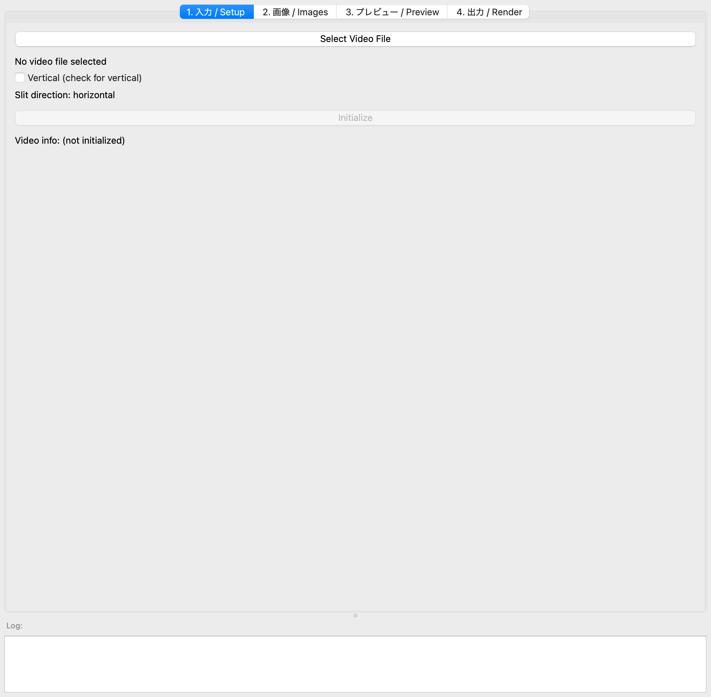
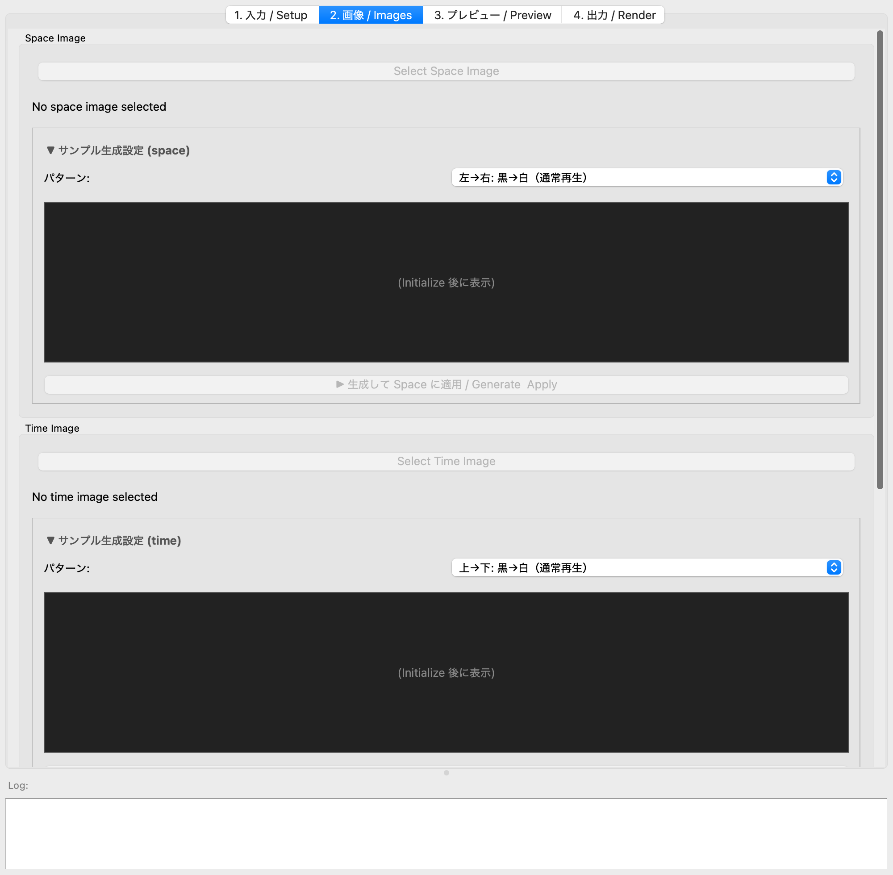
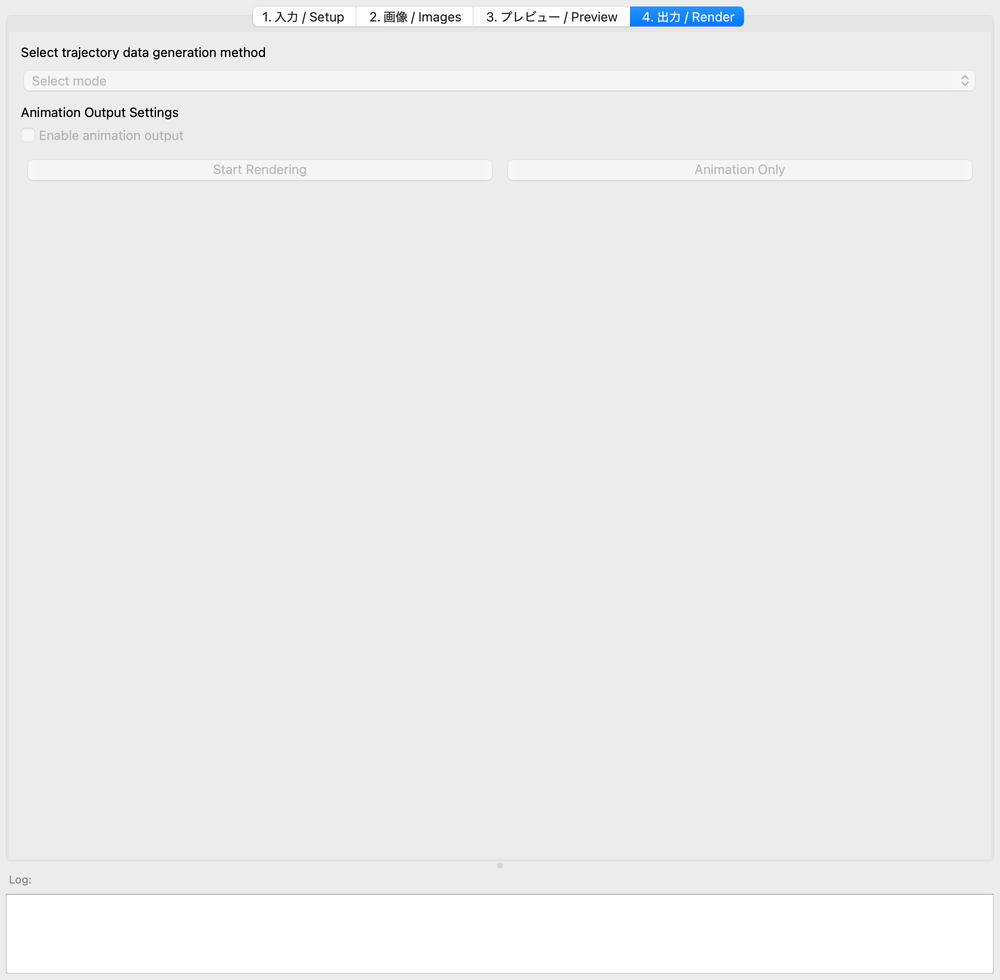
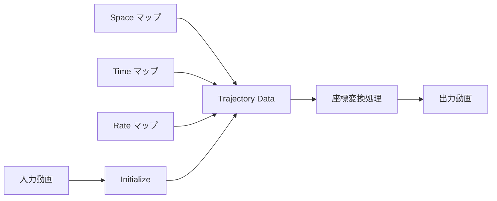

# Shape of Time Flow

`Shape_of_time_flow.py` は、動画の **時間・空間・再生レート** を1枚ずつの
グレースケール画像（マップ）で自由に「描く」ことで、逆再生と順再生が同時に
起きるような**新しい時間の流れ**を持つ映像をつくる PyQt5 製 GUI ツールです。

映像は「静止画（フレーム）の連なり」です。この構造を逆手に取り、各画素が
入力動画の *どの時間・どの空間・どんな速度* を参照するかを画像で指定する —
それが本ツールの考え方です（メディアアーティスト Ryu Furusawa のワークショップ
"Shape of Time Flow" のためのツール）。

---

## 目次

- [考え方（3枚のマップ）](#考え方3枚のマップ)
- [縦スリット / 横スリット](#縦スリット--横スリット)
- [セットアップ](#セットアップvenv-推奨)
- [使い方（GUI 手順）](#使い方gui-手順)
- [処理の流れ](#処理の流れ)
- [出力画像フォーマット（Photoshop で自作する場合）](#出力画像フォーマットphotoshop-で自作する場合)
- [クレジット / 参考作品](#クレジット--参考作品)

---

## 考え方（3枚のマップ）

出力の1フレームずつではなく、動画「全体」を1枚の画像として扱います。
入力動画に対して、次の **3種類の16bitグレースケール PNG** を用意します。


| マップ | 明るさが意味するもの | 「通常再生」に相当する絵 |
|--------|----------------------|--------------------------|
| **Space（空間座標）** | その画素がスリット上のどの位置を参照するか | 左→右の黒→白グラデーション（素通し・等倍） |
| **Time（時間座標）** | その画素が入力動画の「どの時刻」を参照するか | 上→下の黒→白グラデーション（先頭→末尾へ等速） |
| **Rate（再生レート）** | 再生速度・方向（速い/遅い/逆再生/停止） | 50% グレー均一（等速・順再生） |

この「通常再生」マップを**描き変える**と時間の流れそのものが変わります。
たとえば Time マップに波形を描けば、順再生と逆再生が周期的に入れ替わります。


> Time マップの明暗 = 各画素における入力動画の「時間位置」。
> 上から下へなめらかに白くなれば等速の順再生、途中で反転すれば逆再生が混ざります。

---

## 縦スリット / 横スリット

出力映像の1フレームは、入力動画から「スリット」で切り出した1ラインを
時間方向に並べて作ります。スリットの向きは Setup タブの **Vertical** チェックで
切り替えます。

- **Vertical（縦スリット / column）**: 画面を縦のラインで走査。マップの縦軸＝出力時間、横軸＝画像幅。
- **Horizontal（横スリット / row）**: 画面を横のラインで走査。

マップの向き（縦横）も自動的にこれに合わせて生成されます（後述のサンプル生成を使う場合は自動）。

---

## セットアップ（venv 推奨）

クリーンな仮想環境を作ってから依存をインストールします。

```bash
# 仮想環境を作成・有効化
python -m venv .venv
source .venv/bin/activate        # Windows は .venv\Scripts\activate

# サードパーティ依存
pip install -r requirements.txt

# imgtrans（drawManeuver）— 公開 PyPI の "imgtrans" とは別物です。
# `pip install imgtrans` は無関係な他人のパッケージなので使わないこと。
pip install git+https://github.com/ryufurusawa/imgtrans.git
```

> **注意**: `imgtrans` は numba / av(PyAV) / librosa などの重い依存を含み、
> システムに **FFmpeg**（`ffmpeg` と `ffprobe`）が PATH 上にある必要があります。

### 実行

```bash
python Shape_of_time_flow.py
```

---

## 使い方（GUI 手順）

ウィンドウは4つのタブに分かれています。左上から順に進めます。

### ① 入力 / Setup



1. **Select Video File** をクリックし、素材となる動画を選びます（2〜3分程度の、
   面白い「動き」が写ったものが向いています）。
2. スリットの向きを決めます。**Vertical (check for vertical)** をチェックすると
   縦スリット、外すと横スリット（`Slit direction:` の表示で確認）。
3. **Initialize** を押します。動画情報（解像度・フレーム数・FPS）が読み込まれ、
   入力動画と同じ場所に作業用フォルダが作られます。以降のタブが有効になります。

> Initialize 後、各パラメータ欄は動画情報から自動で妥当な初期値に設定されます。

### ② 画像 / Images



Space / Time / Rate それぞれについて、マップ画像を用意します。方法は2つ:

- **A. サンプル生成を使う（お手軽）**
  各セクションの「▼ サンプル生成設定」で **パターン** を選び、プレビューを確認して
  **「生成して … に適用 / Generate & Apply」** を押します。7種類のパターンが選べます:
  - 上→下 / 左→右 の 白→黒・黒→白グラデーション（各方向）
  - 50% グレー均一
  - ランダムノイズ
  - **波形 (Wave)** — 振幅 / 周期 / 位相を編集可能（時間を往復させる等）

  「（通常再生）」と付いたパターンが各セクションの基準（等速・順再生）です。
  生成された PNG は `sample_space_W.png` / `sample_time_VMIN-VMAX.png` /
  `sample_rate_DEV.png` の命名規約で保存され、自動でスロットにセットされます。

- **B. 自作画像を選ぶ（Photoshop 等）**
  **Select Space / Time / Rate Image** から、自分で描いた16bitグレースケール PNG を
  選びます。ファイル名に埋め込まれた数値（範囲）がパラメータとして読み込まれます。
  → 作り方は [出力画像フォーマット](#出力画像フォーマットphotoshop-で自作する場合) を参照。

### ③ プレビュー / Preview

設定したマップやレンダリング結果（内蔵プレイヤー）を確認するタブです。

### ④ 出力 / Render



1. **Select trajectory data generation method** で軌道データの生成方法を選びます:
   - **time to data** — Time マップ（時間座標）を基準に軌道を生成
   - **rate to data** — Rate マップ（再生レート）を基準に軌道を生成
2. 必要なら **Enable animation output** をチェック（軌道の2Dアニメーションも出力）。
3. **Start Rendering** を押すと書き出しが始まります。進捗は下部の **Log** に表示され、
   完了すると入力動画と同じフォルダに出力動画ができます。
   （**Animation Only** は軌道アニメーションのみを出力）

---

## 処理の流れ



Space / Time / Rate の3枚のマップから軌道データ（各画素が入力動画のどこを
参照するか）を組み立て、座標変換を通して最終的な映像を書き出します。

---

## 出力画像フォーマット（Photoshop で自作する場合）

マップを自分で描く場合は、次の形式で保存します。

- カラーモードを **16bit グレースケール** にする（Image / Mode → 16bit grayscale）。
- レイヤーを**すべて統合**する（16bit は単一レイヤーが必要）。
- 画像解像度をスリット向き・出力尺に合わせる（例: 縦スリット・1分/30fps なら高さ1800px）。
- **PNG 形式**で保存する（File / Save As）。
- ファイル名に範囲を埋め込む（例: `time_0-1800.png`, `space_640.png`, `rate_1.00.png`）。

Photoshop では グラデーションツール / 指先ツール / 調整ブラシ / 複数レイヤー /
変形(ワープ) などを使うと、なめらかで有機的な「時間の形」を描けます。

---

## クレジット / 参考作品

**Instructor / Author:** Ryu Furusawa（メディアアーティスト） — <https://ryufurusawa.com>

**参考作品:**
- *Mid Tide #3* (2024) — <https://vimeo.com/911945134>
- *Slack Tide #1* — <https://vimeo.com/918864647>
- *Slack Tide #2* — <https://vimeo.com/918864329>
- Real-time time-trans (p5.js) — <https://editor.p5js.org/ryufurusawa/full/VFpV82w51>
  - スペースキーでスリット走査方向を切替 / Shift + クリックで描画モード切替
