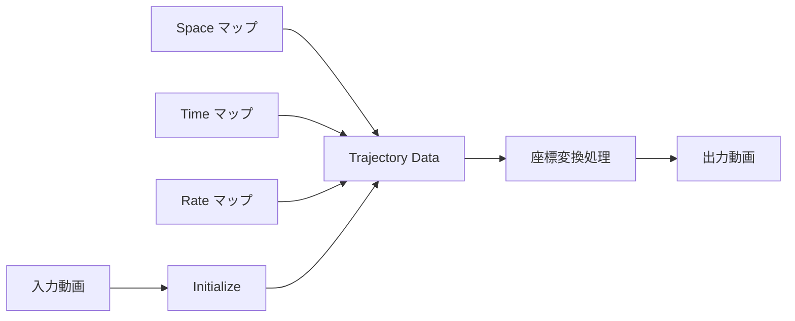

# Shape of Time Flow

**日本語** | [English](README.en.md)

`Shape_of_time_flow.py` は、動画の **時間・空間・再生レート** を1枚ずつの
グレースケール画像（マップ）で自由に「描く」ことで、逆再生と順再生が同時に
起きるような**新しい時間の流れ**を持つ映像をつくる PyQt5 製 GUI ツールです。

映像は「静止画（フレーム）の連なり」です。この構造を逆手に取り、各画素が
入力動画の *どの時間・どの空間・どんな速度* を参照するかを画像で指定する —
それが本ツールの考え方です（メディアアーティスト Ryu Furusawa のワークショップ
"Shape of Time Flow" のためのツール）。

---

## 目次

- [考え方（3枚のマップ）](#考え方3枚のマップ)
- [縦スリット / 横スリット](#縦スリット--横スリット)
- [セットアップ](#セットアップvenv-推奨)
- [使い方（デモで一巡）](#使い方デモで一巡)
- [処理の流れ](#処理の流れ)
- [出力画像フォーマット（Photoshop で自作する場合）](#出力画像フォーマットphotoshop-で自作する場合)
- [言語切り替え（日本語 / English UI）](#言語切り替え日本語--english-ui)
- [クレジット / 参考作品](#クレジット--参考作品)

---

## 考え方（3枚のマップ）

出力の1フレームずつではなく、動画「全体」を1枚の画像として扱います。
入力動画に対して、次の **3種類の16bitグレースケール PNG** を用意します。


| マップ | 明るさが意味するもの | 「通常再生」に相当する絵 |
|--------|----------------------|--------------------------|
| **Space（空間座標）** | その画素がスリット上のどの位置を参照するか | 左→右の黒→白グラデーション（素通し・等倍） |
| **Time（時間座標）** | その画素が入力動画の「どの時刻」を参照するか | 上→下の黒→白グラデーション（先頭→末尾へ等速） |
| **Rate（再生レート）** | 再生速度・方向（速い/遅い/逆再生/停止） | 50% グレー均一（等速・順再生） |

この「通常再生」マップを**描き変える**と時間の流れそのものが変わります。
たとえば Time マップに波形を描けば、順再生と逆再生が周期的に入れ替わります。


> Time マップの明暗 = 各画素における入力動画の「時間位置」。
> 上から下へなめらかに白くなれば等速の順再生、途中で反転すれば逆再生が混ざります。

---

## 縦スリット / 横スリット

出力映像の1フレームは、入力動画から「スリット」で切り出した1ラインを
時間方向に並べて作ります。スリットの向きは Setup タブの **Vertical** チェックで
切り替えます。

- **Vertical（縦スリット / column）**: 画面を縦のラインで走査。
- **Horizontal（横スリット / row）**: 画面を横のラインで走査。

マップの縦横の向きも、この設定に自動で合わせて生成されます。

---

## セットアップ（venv 推奨）

クリーンな仮想環境を作ってから依存をインストールします。

```bash
# 仮想環境を作成・有効化
python -m venv .venv
source .venv/bin/activate        # Windows は .venv\Scripts\activate

# サードパーティ依存
pip install -r requirements.txt

# imgtrans（drawManeuver）— 公開 PyPI の "imgtrans" とは別物です。
# `pip install imgtrans` は無関係な他人のパッケージなので使わないこと。
pip install git+https://github.com/ryufurusawa/imgtrans.git
```

> **注意**: `imgtrans` は numba / av(PyAV) / librosa などの重い依存を含み、
> システムに **FFmpeg**（`ffmpeg` と `ffprobe`）が PATH 上にある必要があります。

### 実行

```bash
python Shape_of_time_flow.py
```

---

## 使い方（デモで一巡）

ウィンドウは4つのタブに分かれています。ここでは実際の動画を使い、
**横スリットで初期化 → 空間と時間のマップを入れ替えて生成 → time to data で
プレビュー・レンダリング → 確認映像を表示** までを一巡します。

### ① 入力 / Setup


1. **Select Video File** で素材動画を選びます（2〜3分程度の、面白い「動き」が
   写ったものが向いています）。
2. スリット向きを決めます。今回は **横スリット**なので **Vertical** の
   チェックは外したまま（`Slit direction: horizontal`）。
3. **Initialize** を押すと、動画情報（解像度・フレーム数・FPS）が読み込まれ、
   入力動画と同じ場所に作業用フォルダが作られます。以降のタブが有効になります。

### ② 画像 / Images（空間と時間を入れ替える）


1. **共通サイズ設定**: スキャン方向サイズは映像から自動（この例では 360）。
   **時間方向サイズを 300** にします（＝出力の長さ 300 フレーム）。
2. **Space / Time マップを入れ替え**て生成します:
   - **Space** セクションのパターンを **「上→下: 黒→白」**（通常は Time の絵）に。
   - **Time** セクションのパターンを **「左→右: 黒→白」**（通常は Space の絵）に。
   - 各セクションの **「▶ 生成して … に適用 / Generate & Apply」** を押すと、
     16bit PNG が生成・自動セットされます
     （`sample_space_360.png` / `sample_time_0-7363.png`)。

   これで「空間として時間軸を、時間として空間軸を」参照する、デフォルトから
   **時間と空間が交換された**状態になります。

> 自作画像を使う場合は **Select Space / Time / Rate Image** から
> [16bit グレースケール PNG](#出力画像フォーマットphotoshop-で自作する場合) を選びます。

### ③ プレビュー / Preview（time to data）

#### リアルタイム軸間変換プレビュー（GPU）


Preview タブ上部の **リアルタイム軸間変換プレビュー (GPU)** では、書き出しを待たずに
**変換結果を実時間で確認**できます（ワークショップ向けの高速イテレーション）。

- **再構築 / Rebuild** を押すと、入力動画をSD/HDに落として直近フレーム群をGPUに常駐させ、
  現在の space/time マップに従って per-pixel 変換した映像を表示します。
- **▶再生 / ⏸一時停止**、**time / rate** モード、**速度**を調整可能。マップを編集して
  Rebuild し直せば即反映されます。
- 解像度は入力そのまま（最大フルHD、アップスケールなし）。端末メモリに応じて
  自動でプレビュー解像度を調整します（採用中の S / F / メモリを下部に表示）。
- GPUは **wgpu（Metal/D3D12/Vulkan）** を使用。GPUが無い環境では自動でCPUにフォールバック。

> 変換自体はGPUで実質ゼロコスト。ボトルネックは初回のデコードとメモリ（フレーム数×解像度）だけです。

#### 軌道データの確認（2D/3D）


1. **データ生成方法 / Generation method** を **time to data** にします。
2. **プレビュー生成 (2D Plot + 3D GIF)** を押すと、軌道データが作られ、
   - **2D Plot**（Space / Time / Rate の各軌道）
   - **3D Animation (GIF)**（軌道の立体表示）

   が表示されます。書き出し前に「どんな時間の流れになるか」を確認できます。

### ④ 出力 / Render（レンダリング + アニメーション書き出し）


1. **Select trajectory data generation method** を **time to data** に。
2. **Enable animation output** をチェック（軌道の3Dアニメも書き出す）。
   Animation Duration（秒）を指定します。
3. **Start Rendering** を押すと書き出しが始まり、進捗が下部 **Log** に出ます。
4. 完了すると **レンダリング結果プレビュー** に本編動画と3Dアニメが読み込まれ、
   内蔵プレイヤーで確認できます（**外部プレイヤーで開く** ボタンもあり）。

書き出された確認映像（本編）のフレーム例:


入力動画の街並みが、入れ替えたマップに従って時間・空間の関係を組み替えられた
状態で出力されています。

---

## 処理の流れ



Space / Time / Rate の3枚のマップから軌道データ（各画素が入力動画のどこを
参照するか）を組み立て、座標変換を通して最終的な映像を書き出します。

---

## 出力画像フォーマット（Photoshop で自作する場合）

マップを自分で描く場合は、次の形式で保存します。

- カラーモードを **16bit グレースケール** にする（Image / Mode → 16bit grayscale）。
- レイヤーを**すべて統合**する（16bit は単一レイヤーが必要）。
- 画像解像度をスリット向き・出力尺に合わせる（例: 縦スリット・1分/30fps なら高さ1800px）。
- **PNG 形式**で保存する（File / Save As）。
- ファイル名に範囲を埋め込む（例: `time_0-1800.png`, `space_640.png`, `rate_1.00.png`）。

Photoshop では グラデーションツール / 指先ツール / 調整ブラシ / 複数レイヤー /
変形(ワープ) などを使うと、なめらかで有機的な「時間の形」を描けます。

---

## 言語切り替え（日本語 / English UI）

Setup タブ右上の **Language / 言語** で、UI を **日本語 / English** に切り替えられます。
起動時のデフォルトは日本語です。英語で起動したい場合は環境変数でも指定できます:

```bash
STF_LANG=en python Shape_of_time_flow.py
```

---

## クレジット / 参考作品

**Instructor / Author:** Ryu Furusawa（メディアアーティスト） — <https://ryufurusawa.com>

**参考作品:**
- *Mid Tide #3* (2024) — <https://vimeo.com/911945134>
- *Slack Tide #1* — <https://vimeo.com/918864647>
- *Slack Tide #2* — <https://vimeo.com/918864329>
- Real-time time-trans (p5.js) — <https://editor.p5js.org/ryufurusawa/full/VFpV82w51>
  - スペースキーでスリット走査方向を切替 / Shift + クリックで描画モード切替
